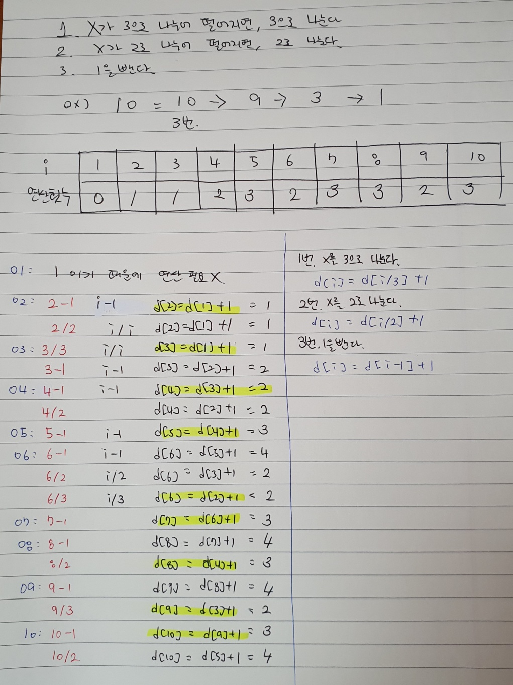

## NO10824. 네 수 (BRONZE III)

입력 값을 제대로 확인하지 못해서 `런타임 에러(NumberFormat)`가 발생

[입력]<br/>
첫 째 줄에 네 자연수 A,B,C,D가 주어지고 각각의 자연수 범위는 다음과 같다. <br/>
1 <= A, B, C, D <= 1,000,000

그 말은 붙인 수의 최대 값이 `20,000,002,000,000`이 나올 수 있기 때문에 `Integer.valueOf`로 처리 해줄 경우 오버플로우가 발생하여 에러가 발생한 것이라고 추측된다.

<br/>

---

<br/>

## NO10808. 알파벳 개수 (BRONZE IV)

알파벳 소문자로만 이루어진 단어 S가 주어지고, 각 알파벳이 단어에 몇 개가 포함되어 있는지 구하라.<br/>
단어의 길이는 100을 넘지 않으며, 알파멧 소문자로만 이루어져 있다.

[출력]<br/>
단어에 포함되어 있는 각각의 알파벳 개수는 공백을 구분하여 출력한다.

<br/>

---

<br/>

## NO1406. 에디터

한 줄로 된 에디터를 구현하려고 하는데 이 에디터는 영어 소문자만을 기록할 수 있는 편집기로, 최대 600,000글자까지 입력할 수 있다.

이 편집기에는 '커서'라는 것이 있는데, 커서는 문장의 맨 앞, 문장의 맨뒤, 또는 문장 중간 임의의 곳에 위치할 수 있다.

즉, 길이가 L인 문자열이 현재 편집기에 입력되어 있으면, 커서가 위치할 수 있는 곳은 L+1가지 경우가 있다.

이 편집기가 지원하는 명령어는 4개가 있다.
```
L: 커서를 왼쪽으로 한 칸 옮김 (커서가 문장의 맨 앞이면 무시됨)
D: 커서를 우측으로 한 칸 옮김 (커서가 문장의 맨 뒤이면 무시됨)
B: 커서 왼쪽에 있는 문자를 삭제 (커서가 문장의 맨 앞이면 무시됨)
P $: $라는 문자를 커서 왼쪽에 추가함
```

초기에 편집기에 입력되어 있는 문자열이 주어지고, 그 이후 명령어가 차례로 주어졌을 때, 모든 명령어를 수행하고 난 후 편집기에 입력되어 있는 문자열을 구하는 프로그램을 작성하시오.

[입력]<br/>
첫째 줄에는 문자열이 주어지고, 문자열의 길이는 100,000을 넘지 않는다.<br/>
둘째 줄에는 입력할 명령어의 개수를 나타내는 정수가 주어진다.<br/>
셋째 줄에는 M개의 줄에 걸쳐 입력할 명령어가 순서대로 주어진다.


```
[고민]
최대 600,000 글자를 입력할 수 있기 때문에 범위는 int여도 OK
삽입/삭제 시 시간복잡도가 O(1)인 LinkedList를 이용하는 자료구조 Queue or Deque
>> 특정 필드 중간에 추가를 하는 경우라면?
1. 왼쪽 필드를 보관한다. >> aaaa인 경우에 체크가 되질 않음
2. 지난번 문제중 push(pop)하는 걸로 한다면? >> 초기 상태(abcdxxxx)로 만드는 게 어려움  
==
[참고한 내용]
Queue나 Deque가 아닌 LinkedList를 그냥 사용
>> LinkedList.add는 인덱스로 추가 할 수 있다. 
```


참고한 내용을 바탕으로 `LinkedList`로 접근을 했으나 시간 초과 문제가 발생했음

`BufferedReader`, `BufferedWriter`를 모두 사용했음에도 시간 초과가 났다는 건 기존과는 다르게 접근해야 한다고 생각돼서 구글링을 참고하여 접근함 

ㅡ

### [참고 링크](https://minhamina.tistory.com/17)

> 참고한 포스팅에 의하면 LinkedList가 가지는 검색의 시작복잡도인 O(N)으로 인한 것 때문이라고 한다. <br/>
> 그래서 연산이 이루어지는 삽입/삭제/탐색의 시간 복잡도 O(1)이 이루어져야 한다고 한다.
> 
> 포스팅 작성자도 다른 사람의 글을 참고했고 접근한 방법이 ListIterator 라고 한다.
> 
> 간단하게는 ListIterator는 Iterator를 상속한 인터페이스이고, Iterator(단방향 탐색)와 달리 양방향 탐색이 가능하다고 한다.<br/>
> 다형성 구조를 갖추려고 아래와 같이 구성해봤는데 Iterator에는 hasPrevious, hasNext의 메서드를 갖질 않아서 부모 클래스를 상속한 ListIterator를 사용해야 했다. <br/> 
> `ListIterator<Character> iterator = linkedList.listIterator();`
> 
> 또 하나 알아낸 점은 String의 더하기 연산에서도 시간 초과가 났다는 것이다.
> 
> 기존 코드는 다음과 같다.
> ```java
> String rst = "";
>
> for (Character character : linkedList) {
>     rst += character;
> }
> bw.write(rst);
> bw.flush();
> ```
>
> 위 코드로 실행할 경우 타임아웃 에러가 나지만 아래와 같이 변경할 경우 통과되었다.
> ```java
> for (Character character : linkedList) {
>     bw.write(character);
> }
> bw.flush();
> ```

시간 초과로 실패한 LinkedList를 index로 접근한 코드는 다음 링크를 참고하길 바란다. 

[LinkedList를 index로 접근](https://github.com/upsk1/AlgorithmJava/blob/main/%EC%84%B1%EC%9E%AC/jae-workspace/src/main/java/study/jaeworkspace/baekjoon/w02/NO1406.java)


<br/>

---

<br/>

> 동적 계획법 알고리즘이 익숙하지 않기도 하고, 접근 방법을 익힐 필요가 있어서 `1로 만들기`와 `2xn 타일링`은 구글링을 참고하여 구현했습니다. 


## NO1463. 1로 만들기

사용할 수 있는 연산
```
1. X가 3으로 나누어 떨어지면, 3으로 나눈다.
2. X가 2로 나누어 떨어지면, 2로 나눈다.
3. 1을 뺀다.
```

정수 X가 주어졌을 때 위 세 개의 연산을 사용해서 1을 만들려고 한다.<br/>
이때 연산을 사용하는 횟수의 최솟값을 출력하시오.

시간제한 0.15초<br/>
1 <= X <= 10^6 (1,000,000)

```
시간 제한이 있어서 지금까지 알았던 방식으로는 풀 수 없다고 생각했고 알고리즘 유형을 보니까 DP로 되어있어서 예전에 DP를 딱 한 문제 풀면서 정리한 걸 복기함

DP 방식 (재귀와 유사)
1. Tabulation: Bottom Up (반복문)
2. Memoization: Top Down (재귀)

한 번 구한 문제의 결과를 재사용할 경우 매우 효율적으로 문제 해결이 가능하다.
피보나치 수열의 경우 O(n^2) -> O(f(n))으로 단축 가능

기본 매커니즘은 "문제를 나누고, 그 문제의  결과 값을 재활용하여 답을 구한다."
그래서 동일한 작은 문제들이 반복해서 나타나는 경우 적용하면 효율적이다.
```

내가 아는 동적 계획법에 대한 지식은 위 내용이 전부이다.<br/>
그렇기에 다른 사람은 어떻게 접근했는지에 대한 아이디어를 알 필요가 있었다.

우선 재귀를 사용하는 메모이제이션 방법의 경우 두 가지를 도출해야 했었던 걸로 기억한다.
1. 점화식
2. 초기값

피보나치 수열 공식은 익숙했기에 과거에 푼 문제는 쉬운 편에 속했지만 그렇지 않은 경우에 도출해내기 어렵겠다고 생각했었다.

[1로 만들기 자바.velog](https://velog.io/@kimmjieun/백준-1463번-1로-만들기-Java-자바)에 의하면 3가지 단계를 생각해야 한다고 한다.

1. 테이블 정의 = 문제 요구 사항 정의
2. 점화식 찾기
3. 초기값 정하기

> 1.테이블 정의<br/>
> D[i] = 정수가 i를 1로 만들때 연산을 하는 횟수의 최솟값
> 
> 3.초기값 정하기 <br/>
> 1을 만들어야 하기 때문에 D[0] = D[1] = 0
> 
> 2.점화식 찾기<br/>
> - 1번: X를 3으로 나눈다
> d[i] = d[i/3] + 1
> - 2번: X를 2로 나눈다
> d[i] = d[i/2] + 1
> - 3번: 1을 뺀다
> d[i] = d[i-1] + 1
> 
> [점화식 도출]
> 
> 
> 
> [점화식 도출 참고 포스팅](https://smartpro.tistory.com/24)

<br/>

---

<br/>

## NO11726. 2xn 타일링

2×n 크기의 직사각형을 1×2, 2×1 타일로 채우는 방법의 수를 구하는 프로그램을 작성하시오.

지난번과 마찬가지로 1) 문제 정의, 3) 초기값 설정, 2) 점화식 도출의 순으로 진행했다.

초기값은 `dp[0] = 0, dp[1] = 1, dp[2] = 2`로 도출해냈다.

점화식은 아직 익숙하지 않아서 [풀이를 참고](https://dnf-lover.tistory.com/entry/JAVA-C-%EB%B0%B1%EC%A4%80-11726%EB%B2%88-2xn-%ED%83%80%EC%9D%BC%EB%A7%81-%EB%AC%B8%EC%A0%9C-DP-%EC%95%8C%EA%B3%A0%EB%A6%AC%EC%A6%98)했다.

앞선 `1로 만들기` 문제와 마찬가지로 경우의 수를 나타내야 했고, 경우의 수는 시작을 `1x2 타일로 시작`하냐와 `2x1 타일로 시작`하냐로 나뉘었다.

그래서 dp[3]으로 예시를 든다면 다음과 같다.

```
=== [2x3 타일] ===
1. 1x2 타일로 시작
|ㅡㅡ
|ㅡㅡ

2. 2x1 타일로 시작
ㅡㅡ|
ㅡㅡ|
```

식으로 나타낸다면 다음과 같이 나타낼 수 있다.
```
=== [2x5 타일] ===
1x2 타일로 시작하는 것과 2x1 타일로 시작하는 경우의 수가 있다고 했으니까 각 타일로 시작할 경우 다음과 같다.

1. 1x2 타일로 시작
exp = 1 + 2x4

2. 2x1 타일로 시작
exp = 2 + 2x3
```

결과적으로 점화식은 `dp[i] = dp[i-1] + dp[i-2]`가 된다.


