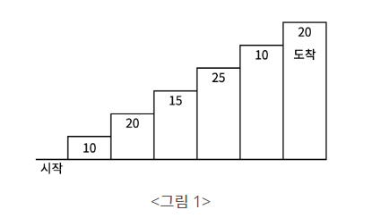

## NO9095. 1,2,3 더하기 (SILVER III)
```
1: 1 = 1
2: 2 = 2
  1+1
  2
3: 3 = 4
  1+1+1
  1+2
  2+1
  3
4: 4 = 7
  1+1+1+1
  1+1+2
  1+2+1
  2+1+1
  2+2
  1+3
  3+1
```

dp[n] = dp[n-1] + dp[n-2] + dp[n-3] 인 건 알겠으나 왜 마지막 1,2,1,1,2,3,1은 계산이 안되는지? <br/>
=> n 값에 도달할 수 있는 것만 따지면 된다?

---

## NO10844. 쉬운 계단 수
자릿수<br/>
자연수: 1234567<br/>
7 = 1번째 자릿수, 6 = 2번째 자릿수, ...

소수: 123.4567<br/>
4 = 1번째 자릿수, 5 = 2번째 자릿수, ...

마지막 자릿수가 0 = 1
마지막 자릿수가 9 = 8

첫째 자릿수는 경우의 수가 1밖에 없으므로 dy[1]의 각 자릿값은 1로 초기화 되어야 한다.


---

### NO2193. 이친수 (SILVER III)
0과 1의 경우의 수는 생각안하고 [n-1]과 [n-2]의 규칙으로 접근했는데 이렇게하면.... 안되겠죠?

---

### NO2579. 계단 오르기 (SILVER III)
각각의 계단에는 일정 점수가 쓰여져 있고, 계단을 밟으면 그 계단에 쓰여진 점수를 얻게 된다.



예를 들어, 1,2,4,6 계단을 밟아서 도착점에 도달하면 총 점수는 75점이 된다.

계단을 오르는 데는 3가지 규칙이 있다.
```
1. 계단은 한 번에 한 계단 또는 두 계단씩 오를 수 있다. (1+1 or 2)
2. 연속된 세 개의 계단을 모두 밟아서는 안 된다. 1+1+1 X
3. 마지막 도착 계단은 반드시 밟아야 한다. 
```
각 계단에 쓰여 있는 점수가 주어질 때 이 게임에서 얻을 수 있는 총 점수의 최대값을 구하시오.

[입력]<br/>
첫째 줄에는 계단의 수가 주어진다.<br/>
둘째 줄부터 한 줄에 하나씩 제일 아래에 놓인 계단부터 순서대로 각 계딴에 쓰여있는 점수가 주어진다.<br/>
계단의 개수는 300이하의 자연수이고, 계단에 쓰여있는 점수는 10,000이하의 자연수이다.

dy[ 0 1 2 3 4 5 ... ]<br/>
> 0: 0 <br/>
> 1: 1 => 10 <br/>
> 2: 2 => 10,20 / 20 <br/>
> 3: 3 => 10,15/20,15/10,20,15 <br/>
> 4: 5 => 

시작(= 3)부터 도달할 수 있는 건 dy[i] = dy[i-3] + dy[i-1]과 dy[i-2]이다.


