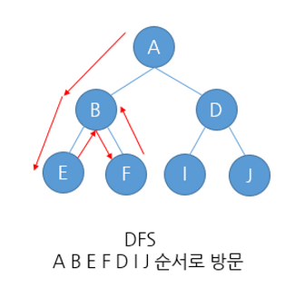
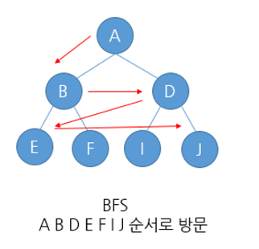
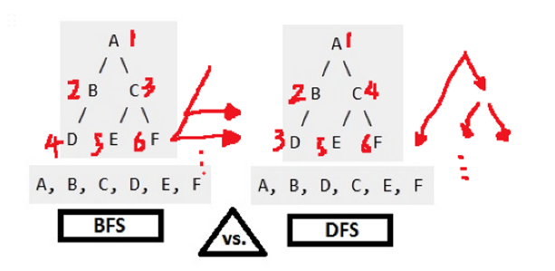
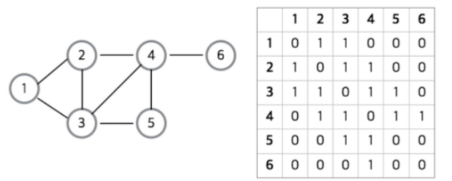
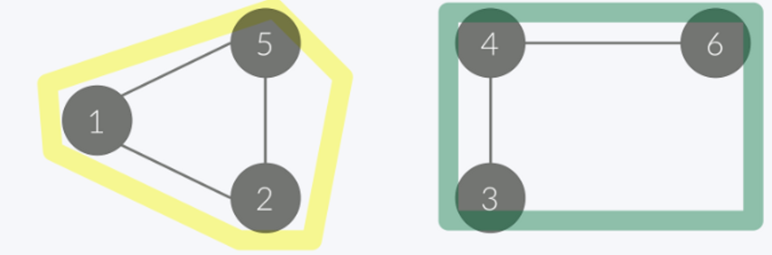

## 그래프의 탐색 방법
### 1. 깊이 우선 탐색(DFS, Depth-First Search)
루트 노드(혹은 임의의 노드)에서 시작해서 다음 분기(branch)로 넘어가기 전에 해당 분기를 완벽하게 탐색하는 방법

> 1. 시작 정점의 한 방향으로 갈 수 있는 경로가 있는 곳까지 깊이 탐색
> 2. 더 이상 갈 곳이 없게 되면, 가장 마지막에 만났던 갈림길 간선이 있는 정점으로 되돌아옴
> 3. 다른 방향의 간선으로 탐색을 계속 반복하여 결국 모든 정점을 방문

### 2. 너비 우선 탐색(BFS, Breadth-First Search)
루트 노드(혹은 임의의 노드)에서 시작해서 인접한 노드를 먼저 탐색하는 방법

> 1. 시작 정점으로부터 인접한 정점들을 모두 차례로 방문하고 나서, 방문했던 정점을 시작으로 하여 다시 인접한 정점들을 차례로 방문하는 방식
> 2. 가까운 정점들을 먼저 방문하고 멀리 있는 정점들은 나중에 방문하는 순회방법
> 3. 인접한 정점들에 대해서차례로 다시 너비 우선 탐색을 반복해야 하므로 선입선출의 구조를 갖는 큐를 사용

## 그래프의 구현
### 1. 인접 리스트
### 2. 인접 행렬
그래프의 노드를 2차원 배열로 만든 것으로 노드간 직접 연결이 되어있으면 1을, 아니면 0을 넣어서 행렬을 완성시킨다.

- 인접행렬의 장점
    1. 2차원 배열 안에 모든 정점들의 간선 정보가 담겨있기 때문에 두 정점에 대한 연결 정보를 조회할 때 $O(1)$ 의 시간복잡도면 가능하다.
    2. 인접리스트에 비해 구현이 쉽다.
- 인접행렬의 단점
    - 모든 정점에 대해 간선 정보를 대입해야 하므로 $O(n^2)$ 의 시간복잡도가 소요된다.

---

## NO1260. DFS와 BFS
DFS로 탐색한 결과와 BFS로 탐색한 결과를 출력하시오.

단, 방문할 수 있는 정점이 여러 개인 경우 정점 번호가 작은 것을 먼저 방문하고, 더이상 방문할 수 있는 점이 없는 경우 종료한다. 간선은 양방향

정점의 번호는 1부터 N까지이다.

[입력] 
첫 줄에 정점의 개수, 간선의 개수, 탐색을 시작할 정점의 번호가 주어진다.

---

## NO11724. 연결 요소의 개수

> **연결 요소**란 나누어진 각각의 그래프를 의미한다.
> 
> 
> 즉, 위 이미지 기준에서는 전체 그래프에 연결 요소가 2개 존재한다고 할 수 있다.

무방향 그래프가 주어졌을 때 연결 요소의 개수를 구하시오. 
첫째 줄에는 정점의 개수 N과 간선의 개수 M이 주어진다.

